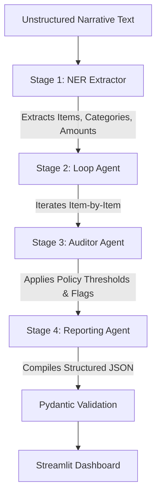
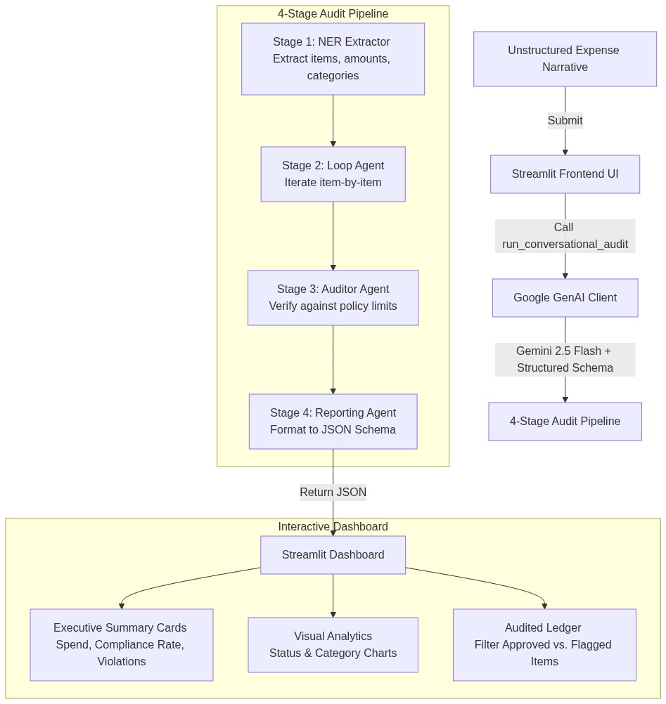
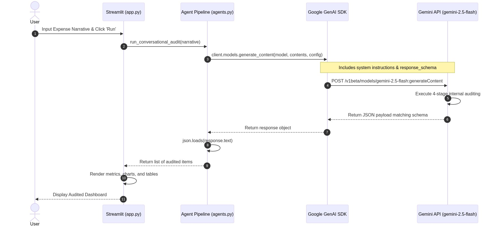

# 💼 Conversational Enterprise Expense Auditor

An AI-powered, single-pass compliance auditing system that transforms unstructured conversational expense narratives into structured, audited corporate ledgers. Built using the latest **Google GenAI SDK**, **Gemini 2.5 Flash**, and **Streamlit**.

---

## 🔍 Overview

The **Conversational Enterprise Expense Auditor** solves a common corporate pain point: employees reporting expenses in unstructured, conversational formats (e.g., chat messages, emails, or quick notes) rather than structured forms. 

By utilizing the advanced reasoning capabilities of Gemini 2.5 Flash and strict Pydantic schemas, this application extracts, classifies, audits, and structures expense data in a single pass, providing a beautiful, real-time compliance dashboard.

---

## 🏗️ Architecture & Pipeline

The system uses a strict **4-stage internal auditing pipeline** executed by the Gemini model:



### The 4 Stages
1. **SEQUENTIAL AGENT (NER Extractor)**: Reads the unstructured text, extracts distinct expense items with their names and amounts, and classifies them strictly into one of three categories: `Meals`, `Software`, or `Travel`.
2. **LOOP AGENT**: Deterministically iterates through each of the extracted items.
3. **AUDITOR AGENT**: Evaluates each item against corporate policy thresholds:
   * **Meals**: Max $50.00
   * **Software**: Max $100.00
   * **Travel**: Max $500.00
   
   Flags each item as either `APPROVED` (within limit) or `VIOLATION` (exceeds limit) and provides a clear, concise reason (e.g., *"Exceeds limit of $500.00 by $120.00"*).
4. **REPORTING AGENT**: Compiles the final audited state into a structured JSON payload conforming to the Pydantic schema.

---

## 📊 Diagrams

### Workflow Diagram


### Sequence Diagram


---

## 🛠️ Tech Stack

* **Core AI**: [Google GenAI SDK](https://github.com/google/generative-ai-python) (`google-genai==0.1.0`)
* **Model**: `gemini-2.5-flash`
* **Frontend Dashboard**: [Streamlit](https://streamlit.io/) (`streamlit==1.35.0`)
* **Data Validation**: [Pydantic](https://docs.pydantic.dev/) (`pydantic==2.7.0`)
* **Data Manipulation**: [Pandas](https://pandas.pydata.org/) (`pandas==2.2.0`)
* **Configuration**: [Python-Dotenv](https://github.com/theofidry/django-dotenv) (`python-dotenv==1.0.1`)

---

## 📋 Corporate Expense Policy Guidelines

| Expense Category | Threshold Limit | Policy Description |
| :--- | :--- | :--- |
| **Meals** | Max $50.00 | Covers client lunches, team dinners, coffee meetings, and travel dining. |
| **Software** | Max $100.00 | Covers subscriptions, developer tools, cloud hosting, and SaaS products. |
| **Travel** | Max $500.00 | Covers flights, hotel bookings, trains, car rentals, and long-distance transport. |

---

## 🚀 Getting Started

Follow these steps to set up and run the application locally.

### 1. Prerequisites
Ensure you have **Python 3.10+** installed on your system.

### 2. Clone or Navigate to the Directory
Navigate to the project root directory:
```bash
cd c:/Users/KIIT0001/Desktop/gkg
```

### 3. Install Dependencies
Install the required packages using `pip`:
```bash
pip install -r requirements.txt
```

### 4. Configure Environment Variables
Create a `.env` file in the root directory (if it doesn't already exist) and add your Gemini API key:
```env
GEMINI_API_KEY=your_gemini_api_key_here
```
*(Alternatively, you can use `GOOGLE_API_KEY` as the variable name).*

### 5. Run the Application
Start the Streamlit server:
```bash
python -m streamlit run app.py
```

Once started, the application will be available in your browser at `http://localhost:8501`.

---

## 📂 Project Structure

* `app.py`: The main Streamlit dashboard application with custom styling and analytics visualization.
* `agents.py`: Contains the GenAI client configuration, prompt engineering, and the 4-stage audit pipeline logic.
* `requirements.txt`: List of Python dependencies.
* `.env`: Environment configuration file (contains API keys).
* `workflow_diagram.png` & `sequence_diagram.png`: Visual representations of the auditing process.
